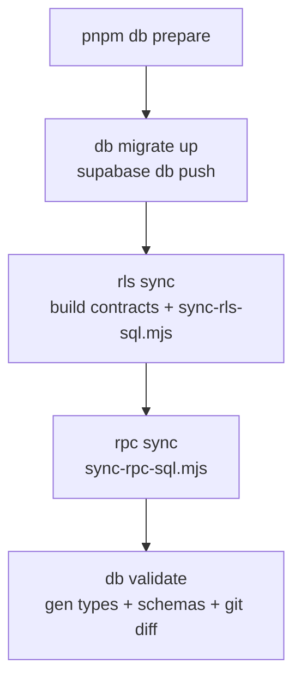
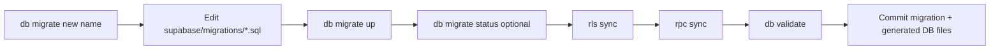
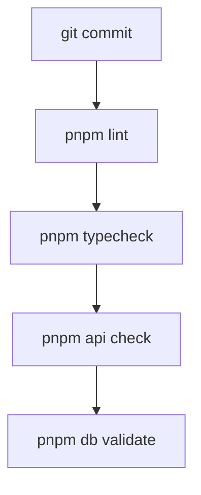
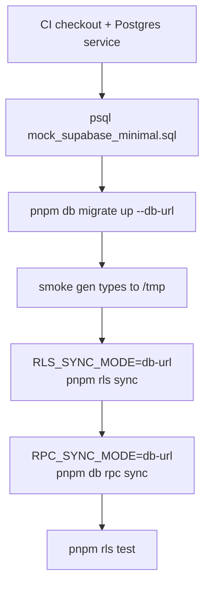
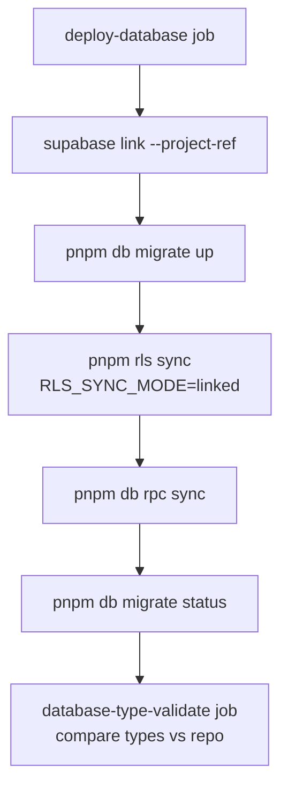
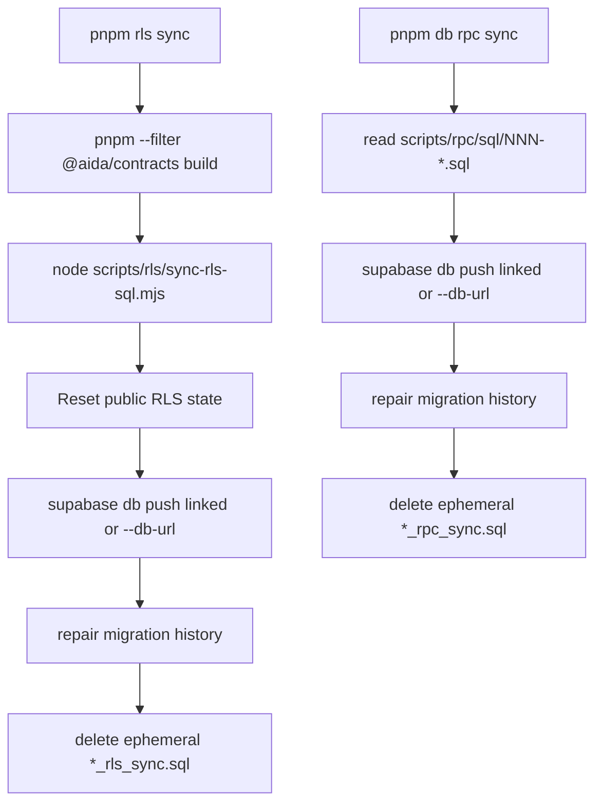
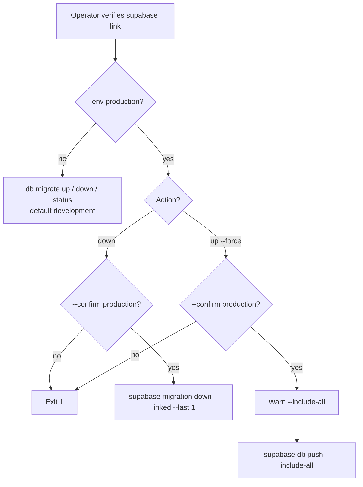

# ADR 0006: Internal Database CLI (Grouped Entry Points)

## Status

Accepted

## Context

Database, migration, and RLS operations at the monorepo root were previously exposed as a **flat list** of `package.json` scripts, for example:

| Old pattern | Problem |
| ----------- | ------- |
| `migrate:up`, `migrate:up:prod`, `migrate:up:force`, `migrate:up:force:prod` | Four names for two behaviours (`db push` vs `db push --include-all`) multiplied by environment |
| `db:types`, `db:types:local`, `db:validate`, `db:validate:local` | Same command surface split across colon-separated script names |
| `prepare-db` | One-off composite name that did not group with `db` or `migrate` |
| `cross-env NODE_ENV=…` on every migrate script | Environment duplicated in shell strings instead of one validated flag |
| `prerls:sync` | Hidden pnpm lifecycle hook; operators did not see that `rls:sync` always built contracts first |

Operators had to memorise many script names. Production vs development was implied by script suffix (`:prod`) rather than an explicit `--env` flag. Dangerous production actions (`migrate down`, `migrate up --force`) had no shared confirmation guard. Help text and examples could not be attached per command group without duplicating strings in `package.json`.

Cross-cutting workflows (schema change → types → RLS) are already documented in [db-schema.md](../db-schema.md) and [auth-rbac.md](../auth-rbac.md). The repo also follows the pattern established in [ADR 0002](0002-authz-rls-generation-cli.md) and [ADR 0005](0005-api-client-types-codegen.md): **thin root scripts** that delegate to repo-owned tooling, while Supabase CLI remains the apply engine.

## Decision

Replace the flat script list with a **small visible menu** and a thin TypeScript CLI under `tools/`:

| Root entry | Role |
| ---------- | ---- |
| `pnpm db` | Types, validation, migrations, full linked-project `prepare` |
| `pnpm rls` | `sync`, `test` |
| `pnpm api` | API client type generation |
| `pnpm test` | Full workspace tests plus `watch` / `coverage` modes |
| `pnpm run help` | Full CLI help (`pnpm help` is reserved by the pnpm CLI) |

Keep lifecycle scripts unchanged: `dev`, `build`, `lint`, `typecheck`, `test`, `format`, and `prepare`.

### Implementation shape

- **`tools/cli.ts`** — registers command groups only; parses `process.argv`; global metadata and error behaviour.
- **`tools/commands/{api,db,migrate,rls,test}.ts`** — Commander subcommands and orchestration.
- **`tools/lib/{run,env,confirm,paths}.ts`** — shared behaviour:
  - `run` — `child_process.spawn` with inherited stdio and a printed `$ command` line.
  - `env` — `--env development | production` (default `development`); sets `NODE_ENV` only.
  - `confirm` — `--confirm production` for dangerous production migrate actions.
  - `paths` — generated DB types path and temp file for atomic writes.
  - `db-url` — Postgres URL validation and env tweaks for `db migrate up --db-url` (CI / ephemeral DB).

**Do not keep deprecated aliases** for old `db:*`, `migrate:*`, root `migrate`, `rls:*`, `test:*`, or `api-client:*` script names. Documentation and CI are updated to the new interface.

### Environment and targeting

- **`--env`** validates `development` or `production` and fails fast on unknown values. Every migrate subcommand prints the resolved environment before running.
- **Supabase project targeting** is unchanged: `supabase link` (and CI secrets / `supabase link --project-ref`) decide which database is touched. `--env` does **not** select a project.

### Safety rules

| Command | Guard |
| ------- | ----- |
| `pnpm db migrate down --env production` | Requires `--confirm production` |
| `pnpm db migrate up --env production --force` | Requires `--confirm production`; prints warning about `--include-all` |
| `pnpm db migrate up --force` (any env) | Prints warning before `supabase db push --include-all` |

### Why TypeScript + Commander + tsx (not more shell)

| Option | Outcome |
| ------ | ------- |
| **More `package.json` shell** | Hard to share validation, confirmation, and composite flows (`db prepare`); prod/dev duplication returns. |
| **New published CLI package** | Overkill for repo-local commands; adds versioning and workspace wiring. |
| **TypeScript under `tools/` + root `tsx` scripts** | **Chosen.** Matches ADR 0002/0005 “repo-owned bridge” pattern; grouped help and examples; typed guards; `db prepare` can call migrate/rls runners in-process without nested `pnpm` for every step. |
RLS generation and apply remain in `scripts/rls/` per ADR 0002; hand-written RPC sync remains in `scripts/rpc/` per [ADR 0010](0010-hand-written-rpc-ephemeral-sync.md). The CLI invokes those scripts (RLS also builds `@aida/contracts` first).

## Consequences

- Operators learn grouped entry points instead of many colon-separated script names.
- Production risk is explicit (`--env production` + `--confirm production` where required).
- `db prepare` encodes the recommended linked-project pipeline in one command: apply migrations, sync RLS, sync hand-written RPCs, then validate generated DB files.
- `db prepare` avoids automatic migration status calls and duplicate type generation to reduce linked Supabase CLI calls; read-only type introspection commands retry transient failures.
- CI and docs must reference grouped commands (`pnpm db migrate up`, not `pnpm migrate:up`).
- `pnpm run help` is required for top-level help because pnpm reserves `help`.
- The CLI is dev-only tooling; it is not published and is typechecked via `tools/tsconfig.json`.
- Future commands should extend `tools/commands/*` rather than growing `package.json` script strings.

---

## Usage flows

The diagrams below describe **what runs**, in order. Dashed steps are optional or environment-specific.

### 1. Cloud dev — full linked-project prep

Typical after `supabase login` and `supabase link` to the dev project.

```sh
pnpm db prepare
```



### 2. Cloud dev — schema change (step by step)

Same outcome as prepare, but controlled step-by-step (see [db-schema.md](../db-schema.md)).



| Step | Command | Mutates remote? |
| ---- | ------- | ----------------- |
| Scaffold | `pnpm db migrate new <name>` | No (local file only) |
| Apply | `pnpm db migrate up` | Yes |
| RLS | `pnpm rls sync` | Yes (ephemeral migration + push) |
| Drift check | `pnpm db validate` | No (writes generated files, then diffs) |

### 3. PR / pre-commit quality (no DB mutation)



| Check | Command | Needs Supabase link? |
| ----- | ------- | -------------------- |
| API client SDK | `pnpm api check` | No |
| DB generated types + schemas | `pnpm db validate` | Yes (pre-commit; linked project) |

### 4. CI — database dry run (ephemeral Postgres)

Job: `database-dry-run` on PRs and pushes to `develop` / `rewrite` / `staging`. Migrations via `pnpm db migrate up --db-url`; RLS and tests via `pnpm rls sync` / `pnpm rls test`. Type smoke still uses raw `supabase gen types --db-url` to `/tmp` (not `pnpm db validate`).



`pnpm rls sync` internally: build `@aida/contracts` → `node scripts/rls/sync-rls-sql.mjs` (ephemeral `*_rls_sync.sql` → push → repair → delete file).

### 5. CI — deploy database (staging / master)

On push to `staging` or `master`. GitHub Environment supplies `SUPABASE_PROJECT_REF`; job links then uses **default development** `NODE_ENV` (no `--env production` in workflow).



### 6. Database targeting — linked project vs disposable Postgres

| Mode | When | Migrate | RLS | Bootstrap |
| ---- | ---- | ------- | --- | --------- |
| `linked` (default) | Cloud dev, deploy staging/master | `pnpm db migrate up` after `supabase link` | `pnpm rls sync` | `pnpm db rpc sync` |
| `db-url` | CI `database-dry-run`, local disposable Postgres | `pnpm db migrate up --db-url "$DATABASE_URL"` | `RLS_SYNC_MODE=db-url pnpm rls sync` | `RPC_SYNC_MODE=db-url pnpm db rpc sync` |

`DATABASE_URL=https://<project>.supabase.co` is an app URL, not a Postgres connection string for `--db-url`.



### 7. RLS integration tests (CI / disposable Postgres)

```sh
# Migrations on target DB first (db migrate up or CI db push)
export DATABASE_URL=postgresql://postgres:...
export RLS_TEST_DATABASE_URL=postgresql://rls_ci:rls_ci:...
pnpm rls test
```

`pnpm rls test` → `node scripts/rls/test/run-tests.mjs`. Harness URL must be a **non-superuser** role so RLS is not bypassed.

### 8. Production / dangerous migrate (operator)

Explicit environment + confirmation; still depends on **which project is linked**.



Examples:

```sh
pnpm db migrate status --env production
pnpm db migrate down --env production --confirm production
pnpm db migrate up --env production --force --confirm production
```

### 9. Disabled / unsupported paths

| Request | Behaviour |
| ------- | --------- |
| `pnpm db migrate status --env nope` | Unknown env; exit 1 |
| Old `pnpm migrate`, `pnpm migrate:up`, `pnpm rls:sync`, `pnpm prepare-db` | Removed; use grouped subcommands |

---

## References

- CLI implementation: `tools/cli.ts`, `tools/commands/`, `tools/lib/`
- Operator docs: [db-schema.md](../db-schema.md), [monorepo.md](../monorepo.md#database-and-rls-cli-toolsclits), [operations.md](../operations.md)
- RLS generation: [ADR 0002](0002-authz-rls-generation-cli.md)
- Hand-written RPC sync: [ADR 0010](0010-hand-written-rpc-ephemeral-sync.md)
- API client codegen: [ADR 0005](0005-api-client-types-codegen.md)
- CI: `.github/workflows/ci.yml`
