# ADR 0010: Hand-written RPC Ephemeral Sync

## Status

Accepted

## Context

Some PostgreSQL behaviour is implemented as **hand-written RPCs** (SECURITY INVOKER functions called from application code), not as generated RLS from `@aida/contracts`. The first example is `public.bootstrap_organization(...)` — it atomically creates an organization, assigns the global Owner role, and inserts the creator's active internal membership (`packages/organizations/src/repositories.ts`).

These RPCs depend on RLS helper state from `pnpm rls sync` (e.g. `current_profile_id()` and seeded roles). They change more often than table DDL and are awkward to maintain as **durable Supabase migrations**:

| Durable migration problem | Effect |
| ------------------------- | ------ |
| Every RPC change needs a new migration file | Git history accumulates overlapping SQL; finding the current definition requires searching timestamps |
| Signature or return-type changes | `CREATE OR REPLACE` does not remove old overloads; follow-up migrations must drop stale signatures |
| Multiple related RPCs | Each new function adds another migration file to hunt through |

[ADR 0002](0002-authz-rls-generation-cli.md) solved the same problem for RLS: apply via ephemeral migration, repair history, delete the file — keep git focused on canonical source files.

## Decision

- **Canonical source:** numbered SQL files under [`scripts/rpc/sql/`](../../scripts/rpc/sql/), e.g. [`001-bootstrap-organization.sql`](../../scripts/rpc/sql/001-bootstrap-organization.sql).
  - Naming: `NNN-kebab-name.sql` (`NNN` = three-digit prefix, e.g. `001`, `002`). Sync sorts alphabetically → stable apply order.
  - Each file is **self-contained:** dynamic drop of all overloads for that function name, then `CREATE FUNCTION` (never `CREATE OR REPLACE`), then `GRANT`.
- **Apply path:** `pnpm db rpc sync` ([`tools/commands/rpc.ts`](../../tools/commands/rpc.ts)) runs [`scripts/rpc/sync-rpc-sql.mjs`](../../scripts/rpc/sync-rpc-sql.mjs):
  1. Read and **combine** all `NNN-*.sql` files from `scripts/rpc/sql/` (with `-- RPC source:` headers)
  2. Write ephemeral `supabase/migrations/<next_version>_rpc_sync.sql` (gitignored)
  3. `supabase db push`
  4. `supabase migration repair <version> --status reverted`
  5. Delete ephemeral file (keep on failure for debugging)
- **Pipeline order:** `pnpm db migrate up` → `pnpm rls sync` → `pnpm db rpc sync` → `pnpm db validate` ([ADR 0006](0006-internal-database-cli.md)). Run RLS first when RPCs call RLS helpers.
- **Targeting** mirrors RLS ([ADR 0002](0002-authz-rls-generation-cli.md)):
  - **Linked (default):** cloud dev and deploy after `supabase link --project-ref`
  - **db-url:** CI `database-dry-run` and disposable Postgres only (`RPC_SYNC_MODE=db-url` + Postgres `DATABASE_URL` or `RPC_SYNC_DATABASE_URL`)
- **Do not** generate RPC SQL from TypeScript. Add new RPCs as new numbered files; no sync script change required.
- **Legacy:** removed durable `bootstrap_organization` migration; one-time `migration repair 20260528173000 --status reverted` where needed. Stale detection also flags legacy `*_bootstrap_organization_sync.sql` ephemeral files.

### Flow

```mermaid
flowchart TD
  f1[001-bootstrap-organization.sql] --> combine[Combine NNN-*.sql]
  f2[002-create-project.sql future] --> combine
  combine --> sync[pnpm db rpc sync]
  sync --> write[Write ephemeral *_rpc_sync.sql]
  write --> push[supabase db push]
  push --> repair[migration repair reverted]
  repair --> delete[Delete ephemeral file]
```

### Adding a new RPC

1. Create `scripts/rpc/sql/002-create-project.sql` (drop overloads for `create_project`, `CREATE FUNCTION`, `GRANT`).
2. `pnpm rls sync` then `pnpm db rpc sync` on the target database.
3. `pnpm db validate` if the RPC is exposed to PostgREST / generated types.

### What stays in durable migrations

Table definitions, constraints, indexes, triggers, and other **schema structure** remain in `supabase/migrations/*.sql`.

## Consequences

- **Positive:** One folder, one file per RPC; combined apply in a single ephemeral push.
- **Positive:** Drop-all-overloads + fresh `CREATE FUNCTION` per file avoids stale signatures.
- **Positive:** Same Supabase CLI engine as RLS; CI and deploy share canonical SQL.
- **Negative:** Fresh databases need migrate up + rls sync + rpc sync; schema alone is insufficient.
- **Negative:** Stale local `*_rpc_sync.sql` (or legacy `*_bootstrap_organization_sync.sql`) blocks sync — repair/remove before retry ([ADR 0002](0002-authz-rls-generation-cli.md) same rule as RLS).
- **Operational:** Never use `RPC_SYNC_MODE=db-url` on real Supabase deploy jobs.

## Alternatives considered

| Alternative | Why not chosen |
| ----------- | -------------- |
| Durable migration per RPC change | Migration archaeology; hard to find live definition |
| Single monolithic SQL file | Harder to edit as RPC count grows |
| `CREATE OR REPLACE` only | Leaves stale overloads when signature changes |
| Generate from `@aida/contracts` | Orchestration RPCs are procedural, not policy metadata |
| Per-RPC CLI subcommands | Unnecessary; one combined sync matches RLS bundle apply |

## References

- RPC SQL: [`scripts/rpc/sql/`](../../scripts/rpc/sql/)
- Sync script: [`scripts/rpc/sync-rpc-sql.mjs`](../../scripts/rpc/sync-rpc-sql.mjs)
- CLI: [`tools/commands/rpc.ts`](../../tools/commands/rpc.ts)
- RLS pattern: [ADR 0002](0002-authz-rls-generation-cli.md)
- DB CLI: [ADR 0006](0006-internal-database-cli.md)
- Legacy repair: `pnpm exec supabase migration repair 20260528173000 --status reverted`
